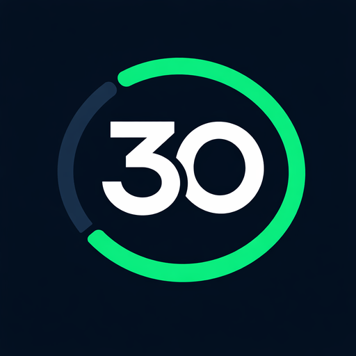

<p align="center">
  
</p>

<h1 align="center">Level30 — Smart HAS</h1>

<p align="center">
  <strong>Smart Habit Acceleration System</strong><br/>
  Gamificação de hábitos acadêmicos com inteligência de risco, mapas e notificações inteligentes
</p>

<p align="center">
  
  
  
  
  
  
  
  
</p>

---

## Sobre o Projeto

**Level30** transforma o desenvolvimento de hábitos acadêmicos em um jogo de RPG. O usuário cria desafios de 30 dias, acumula XP a cada dia completado, avança de nível e recebe alertas inteligentes quando uma sequência está em risco.

O sistema **Smart HAS** (Smart Habit Acceleration System) combina:
- **Motor de risco baseado em regras** — avalia cada desafio com score de 0,0 a 1,0 a partir de uma fórmula determinística (inatividade, progresso e streak) — ver nota abaixo
- **Backend real na nuvem** — autenticação por conta (e-mail/senha), persistência de usuários e desafios em banco próprio, hospedado na Cloudflare (ver [Backend](#backend))
- **Assistente de IA (chat + recomendações)** — companheiro de jornada dentro do app, com respostas geradas por modelo de linguagem hospedado na Cloudflare Workers AI
- **Notificações inteligentes** — alertas contextuais agendados por horário e disparados por nível de risco, funcionando em Android e iOS
- **Mapa de desafios** — visualização dos desafios em mapa dark com CartoDB/OpenStreetMap, posicionados ao redor da localização real do usuário
- **Tour de onboarding** — guia interativo de 6 passos para novos usuários
- **Foto de perfil** — captura por câmera ou galeria, com upload para o backend
- **Integração com APIs reais** — clima em tempo real (Open-Meteo) e citações motivacionais (ZenQuotes)

> Projeto desenvolvido para o **Enterprise Challenge 2026 (FIAP)**, avaliado pela **Leroy Merlin**. Multiplataforma: **Android e iOS**.

---

## Fase 5 — três aplicações, um contrato

A partir da Fase 5 (atividade "Mobile Hybrid App e a Sociedade 5.0"), o projeto é composto por
**três aplicações sobre a mesma API**:

| App | Pasta | Stack | Papel |
|---|---|---|---|
| **App mobile** | `lib/` | Flutter (`provider`) | experiência do estudante |
| **API / núcleo de domínio** | `backend/` | **Java + Spring Boot** | fonte única de verdade: auth, desafios, risco, admin |
| **Dashboard administrativo** | `dashboard/` | **Angular 18** | visão agregada do programa (coordenação) |
| Gateway de IA | `server/` | Cloudflare Worker | único caminho até o Workers AI; agora também proxy do Spring Boot |

O Spring Boot **replica exatamente** o contrato JSON que o Worker já produzia — o app Flutter roda
sem alterar `Challenge.fromJson` / `UserProfile.fromJson`. Contrato congelado em
[`specs/003-fase-5/contract.md`](specs/003-fase-5/contract.md). Planejamento e status em
[`specs/003-fase-5/`](specs/003-fase-5/) (`backlog-po.md`, `STATUS.md`). Visão técnica do app em
[`PROJECT.md`](PROJECT.md).

**Rodar tudo junto:**
```bash
cd backend && JAVA_HOME=$(/usr/libexec/java_home -v 21) mvn spring-boot:run   # API :8080 + Swagger em /swagger-ui.html
cd dashboard && npm install && npm start                                       # dashboard :4200
flutter run --dart-define=API_BASE_URL=http://localhost:8080                    # app apontando pro backend local
```
Seed: `admin@level30.app` / `admin1234` (ADMIN) · `ana@level30.app` / `estudante1` (USER).

---

## Funcionalidades

### Conta e Perfil
- Cadastro e login reais por **e-mail e senha** (senha com hash + salt, sessão via **JWT**)
- Sessão persistida no dispositivo com `flutter_secure_storage` — token não fica em texto puro
- Foto de perfil via câmera ou galeria (`image_picker`), enviada para o backend e exibida com `cached_network_image`
- Logout automático quando o token expira (interceptado nas chamadas à API)

### Assistente de IA
- **Chat** com o "Guia do Level30": tira dúvidas, dá dicas e conversa sobre o progresso do jogador, com respostas rápidas sugeridas
- **Recomendação diária por desafio**: dica curta gerada por IA para cada desafio, combinada com o risco de abandono calculado pelo RiskEngine
- Roda sobre **Cloudflare Workers AI** (modelo Llama 3.1 8B) — ver seção [Backend](#backend)
- Se a IA falhar, o app não quebra: cai em uma sugestão padrão local (fallback), sinalizado na tela com o selo "Sugestão padrão"

### Gamificação
- Sistema de XP com progressão de nível (500 XP por nível)
- Streak diário por desafio (dias consecutivos completados)
- Marcos desbloqueáveis: 7, 14, 21 e 30 dias
- Rankings de título: Iniciante → Lendário

### Desafios
- Criação de desafios com 5 categorias (Saúde, Estudos, Fitness, Mindfulness, Produtividade)
- Duração configurável: 7 a 90 dias
- Recompensa de XP: 100 a 1000 pontos
- Grade visual de progresso dia a dia
- **Swipe para excluir** com confirmação obrigatória

### Motor de Risco (RiskEngine)
```
Score = inatividade(40%) + progressRate(30%) + streak(30%)

LOW      < 0,25  → Nenhuma ação
MEDIUM   < 0,50  → Lembrete
HIGH     < 0,75  → Motivação
CRITICAL ≥ 0,75  → Sugestão de replanejamento
```

> **Nota sobre "IA":** o RiskEngine é um sistema de regras/heurísticas determinísticas e testáveis — não há machine learning, modelo estatístico treinado ou chamada a IA generativa. É uma escolha de engenharia deliberada para um protótipo auditável. Evoluir esse motor para aprendizado de máquina real (ex.: prever risco a partir de padrões históricos de múltiplos usuários) é um candidato natural de roadmap futuro.

### Notificações
- Lembrete diário agendado por horário (timezone America/Sao_Paulo)
- Alertas por nível de risco do desafio
- Notificação de marcos (dias 7, 14, 21, 30)
- Botão de teste na tela de configurações

### Mapa
- Tiles dark CartoDB (sem API key necessária)
- Localização em tempo real via GPS
- Marcadores coloridos por categoria de desafio
- Bottom sheet ao tocar no marcador

### Tour de Onboarding
- 6 passos interativos com overlay escuro e tooltip verde neon
- Aparece apenas na primeira sessão após o login
- Pode ser revisto a qualquer momento pelo Perfil

### Integrações
| Serviço | Uso | Autenticação |
|---|---|---|
| Open-Meteo API | Clima em tempo real + sugestão de desafio | Nenhuma |
| ZenQuotes API | Citações motivacionais | Nenhuma |
| flutter_local_notifications | Notificações locais agendadas | N/A |

---

## Telas

> Identidade visual **100% dark**: fundo `#080A17`, verde neon `#00FF9C`, superfície `#111328`.

| Tela | Descrição |
|---|---|
| **Splash** | Animação de entrada com logo e transição automática |
| **Login / Cadastro** | Autenticação real por e-mail e senha, com alternância entre entrar e criar conta |
| **Home** | Dashboard com desafios, clima atual, citação motivacional e estatísticas |
| **Criar Desafio** | Formulário com categorias, sliders de duração (7–90 dias) e XP (100–1000) |
| **Detalhe do Desafio** | Grade 30 dias, streak, anel de progresso, recomendação gerada por IA (com selo de origem) e botão de concluir |
| **Chat (Guia do Level30)** | Conversa com o assistente de IA, com respostas rápidas sugeridas e histórico de contexto |
| **Mapa** | Mapa dark com marcadores dos desafios e localização GPS |
| **Perfil** | Foto de perfil, nível, XP, estatísticas, marcos atingidos e botão de rever tour |
| **Notificações** | Toggle, seletor de horário, notificação de teste e alertas de risco (Android e iOS) |

---

## Arquitetura

O projeto segue **Clean Architecture** adaptada com três camadas:

```
lib/
├── core/                          # Tema, cores, extensões
│   ├── constants/
│   │   ├── app_colors.dart        # Paleta de cores (sempre via AppColors.*)
│   │   └── app_theme.dart         # MaterialApp ThemeData dark
│   └── extensions/
│       ├── context_extensions.dart
│       └── string_extensions.dart
│
├── data/                          # Camada de dados
│   ├── model/
│   │   ├── challenge.dart         # Entidade Challenge + ChallengeCategory
│   │   ├── risk_assessment.dart   # Entidade RiskAssessment + SuggestedAction
│   │   └── user_profile.dart      # Entidade UserProfile com cálculo de nível
│   └── service/
│       ├── api_client.dart            # Cliente HTTP da API Level30 (Cloudflare Worker)
│       ├── notification_service.dart  # Singleton de notificações locais (Android + iOS)
│       ├── onboarding_service.dart    # Estado do tour (SharedPreferences)
│       ├── quote_service.dart         # ZenQuotes API + fallback local
│       └── weather_service.dart       # Open-Meteo API
│
├── domain/                        # Camada de domínio
│   ├── engine/
│   │   └── risk_engine.dart       # Algoritmo de pontuação de risco
│   └── provider/
│       ├── challenge_provider.dart    # Estado dos desafios
│       ├── chat_provider.dart         # Estado da conversa com o assistente de IA
│       ├── notification_provider.dart # Estado das notificações + SharedPreferences
│       ├── risk_provider.dart         # Wrapper do RiskEngine
│       └── user_provider.dart         # Sessão, dados do usuário, XP e token (secure storage)
│
└── presentation/                  # Camada de apresentação
    ├── screens/                   # 9 telas
    └── widgets/                   # Componentes reutilizáveis
        ├── challenge_card.dart
        ├── category_chip.dart
        ├── delete_confirm_dialog.dart
        ├── level30_app_bar.dart
        ├── motivation_card.dart
        ├── onboarding_tour.dart
        ├── risk_badge.dart
        └── xp_progress_ring.dart
```

### Backend

O app consome uma **API própria**, hospedada como **Cloudflare Worker** (pasta `server/`), substituindo o antigo armazenamento apenas local:

```
server/
├── src/
│   ├── index.ts              # Rotas, CORS e middleware de autenticação (JWT Bearer)
│   ├── auth.ts                # Hash/verificação de senha e emissão/verificação de JWT
│   ├── ai.ts                  # Integração com Workers AI (recomendação por desafio)
│   ├── risk.ts                 # Motor de risco (mesma lógica do RiskEngine do app)
│   └── routes/
│       ├── auth.ts            # POST /auth/signup, POST /auth/login
│       ├── me.ts               # GET /me, PUT /me/avatar (foto de perfil)
│       ├── challenges.ts      # CRUD de desafios + GET /challenges/:id/recommendation
│       └── chat.ts             # POST /chat (assistente de IA conversacional)
└── migrations/                 # Schema do banco D1 (usuários, desafios, avatar)
```

| Camada | Tecnologia |
|---|---|
| Runtime | Cloudflare Workers (serverless, edge) |
| Framework HTTP | Hono |
| Banco de dados | Cloudflare D1 (SQLite na borda) |
| Autenticação | E-mail/senha com hash + salt, sessão via JWT |
| IA generativa | Cloudflare Workers AI — modelo `@cf/meta/llama-3.1-8b-instruct-fast` (Llama 3.1 8B) |

Todas as rotas de dados (`/me`, `/challenges`, `/chat`) exigem `Authorization: Bearer <token>`. O app aponta para a API via `AppConfig.apiBaseUrl` (`lib/core/constants/app_config.dart`), configurável em build time com `--dart-define=API_BASE_URL=...`.

### Gerenciamento de Estado — Provider

```dart
MultiProvider(
  providers: [
    ChangeNotifierProvider(create: (_) => ChallengeProvider()),
    ChangeNotifierProvider(create: (_) => UserProvider()),
    ChangeNotifierProvider(create: (_) => NotificationProvider()..init()),
    ChangeNotifierProvider(create: (_) => ChatProvider()),
  ],
)
```

**Fluxo de dados:**
```
UI (context.watch) → Provider → Engine/Service → notifyListeners() → UI rebuild
```

---

## Stack Técnica

| Categoria | Tecnologia | Versão |
|---|---|---|
| Framework | Flutter | 3.x |
| Linguagem | Dart | ≥ 3.3.0 |
| State Management | Provider + ChangeNotifier | ^6.1.2 |
| Mapa | flutter_map + CartoDB OSM | ^7.0.2 |
| Coordenadas | latlong2 | ^0.9.0 |
| Geolocalização | geolocator | ^13.0.1 |
| Notificações | flutter_local_notifications | ^18.0.1 |
| Timezone | timezone | ^0.9.4 |
| HTTP | http | ^1.2.2 |
| Persistência | shared_preferences | ^2.3.2 |
| Fontes | google_fonts | ^6.2.1 |
| Gráficos | fl_chart | ^0.69.0 |
| Animações | flutter_animate | ^4.5.0 |
| Tour | showcaseview | ^3.0.0 |
| UUID | uuid | ^4.5.1 |
| Permissões | permission_handler | ^11.3.1 |
| Sessão segura | flutter_secure_storage | ^11.0.0 |
| Foto de perfil | image_picker | ^1.1.2 |
| Cache de imagem | cached_network_image | ^3.4.1 |

### Backend (`server/`)

| Categoria | Tecnologia |
|---|---|
| Runtime | Cloudflare Workers |
| Framework | Hono |
| Banco de dados | Cloudflare D1 |
| IA | Cloudflare Workers AI — Llama 3.1 8B Instruct (fast) |
| Linguagem | TypeScript |

---

## Como Rodar

### Pré-requisitos

- [Flutter SDK](https://flutter.dev/docs/get-started/install) 3.x
- Android Studio ou VS Code com extensão Flutter/Dart
- Emulador Android (API 21+) ou simulador/dispositivo iOS (13.0+, requer Xcode e macOS)
- Nenhuma chave de API própria necessária — o app já aponta para a API pública em produção (Cloudflare Workers)

### Instalação

```bash
# 1. Clone o repositório
git clone https://github.com/omateusborba/Level30-Flutter.git
cd Level30-Flutter

# 2. Instale as dependências
flutter pub get

# 3. (iOS) instale os pods
cd ios && pod install && cd ..

# 4. Rode no emulador/simulador ou dispositivo conectado
flutter run
```

### Build APK Release (Android)

```bash
flutter build apk --release
# Saída: build/app/outputs/flutter-apk/app-release.apk (~53 MB)
```

### Build iOS

```bash
flutter build ios --release
# Requer assinatura de código configurada no Xcode (ios/Runner.xcworkspace)
```

### Rodar o backend localmente (opcional)

Por padrão o app usa a API já hospedada em produção. Para rodar o backend localmente:

```bash
cd server
npm install
npx wrangler dev
# Depois, rode o app apontando para o backend local:
flutter run --dart-define=API_BASE_URL=http://localhost:8787
```

### Rodar Testes

```bash
# Todos os testes
flutter test

# Testes unitários do RiskEngine
flutter test test/risk_engine_test.dart
```

---

## Configuração Android

Permissões declaradas no `AndroidManifest.xml`:

```xml
<uses-permission android:name="android.permission.INTERNET"/>
<uses-permission android:name="android.permission.ACCESS_FINE_LOCATION"/>
<uses-permission android:name="android.permission.ACCESS_COARSE_LOCATION"/>
<uses-permission android:name="android.permission.POST_NOTIFICATIONS"/>
```

**Core Library Desugaring** habilitado para `flutter_local_notifications` no Android < 26:

```kotlin
// android/app/build.gradle.kts
compileOptions {
    isCoreLibraryDesugaringEnabled = true
}
dependencies {
    coreLibraryDesugaring("com.android.tools:desugar_jdk_libs:2.1.4")
}
```

---

## Configuração iOS

Permissões declaradas no `ios/Runner/Info.plist` (necessárias para foto de perfil):

```xml
<key>NSPhotoLibraryUsageDescription</key>
<string>O Level30 precisa acessar suas fotos para você escolher uma foto de perfil.</string>
<key>NSCameraUsageDescription</key>
<string>O Level30 precisa acessar a câmera para você tirar uma foto de perfil.</string>
```

**Deployment target**: iOS 13.0 (`ios/Podfile` e `ios/Runner.xcodeproj`).

**Notificações em primeiro plano**: o iOS, por padrão, não exibe banner/som quando o app está aberto. Isso foi corrigido habilitando a apresentação padrão no `DarwinInitializationSettings`:

```dart
// lib/data/service/notification_service.dart
const ios = DarwinInitializationSettings(
  requestAlertPermission: true,
  requestBadgePermission: true,
  requestSoundPermission: true,
  defaultPresentAlert: true,
  defaultPresentBadge: true,
  defaultPresentSound: true,
);
```

---

## APIs Utilizadas

### Open-Meteo
```
GET https://api.open-meteo.com/v1/forecast?latitude={lat}&longitude={lon}&current_weather=true
```
Retorna código meteorológico → app sugere categoria de desafio (sol → Fitness, chuva → Estudos).

### ZenQuotes
```
GET https://zenquotes.io/api/random
```
Retorna `[{"q": "frase", "a": "autor"}]` → exibido na HomeScreen com fallback local.

Ambas as APIs são **gratuitas, sem autenticação** e com **fallback gracioso** — se a rede falhar, o app usa dados locais.

### Level30 API (backend próprio)

```
https://level30-api.mateus-borba.workers.dev
```

| Rota | Método | Descrição | Autenticação |
|---|---|---|---|
| `/auth/signup` | POST | Cria conta (nome, e-mail, senha) | Não |
| `/auth/login` | POST | Login, retorna JWT | Não |
| `/me` | GET | Dados do usuário logado | Bearer JWT |
| `/me/avatar` | PUT | Atualiza foto de perfil | Bearer JWT |
| `/challenges` | GET/POST | Lista/cria desafios | Bearer JWT |
| `/challenges/:id/recommendation` | GET | Dica gerada por IA para o desafio | Bearer JWT |
| `/chat` | POST | Conversa com o assistente de IA | Bearer JWT |

As rotas de IA (`/chat` e `/challenges/:id/recommendation`) usam **Cloudflare Workers AI** (modelo Llama 3.1 8B) e têm fallback para uma resposta padrão caso a IA falhe.

---

## Informações do App

| Item | Valor |
|---|---|
| Package ID (Android) | `com.level30.level30flutter` |
| Bundle ID (iOS) | `com.level30.level30flutter` |
| Versão | 1.0.0+1 |
| Min SDK Android | API 21 (Android 5.0) |
| Target SDK Android | API 34 (Android 14) |
| iOS Deployment Target | iOS 13.0+ |
| APK Release | ~52,9 MB |

---

## Contexto Acadêmico

| Campo | Detalhe |
|---|---|
| Instituição | FIAP |
| Desafio | Enterprise Challenge 2026 — Fase 4 |
| Avaliador | Leroy Merlin |
| Tema | Sociedade 5.0 — Tecnologia a serviço do ser humano |

A documentação técnica completa (arquitetura de rede, NOC, comparativo Flutter vs Kotlin) está em [`DOCUMENTACAO_FASE4.md`](DOCUMENTACAO_FASE4.md).

---

<p align="center">
  Feito com ❤️ para o Enterprise Challenge FIAP 2026 — Level30 Smart HAS
</p>
