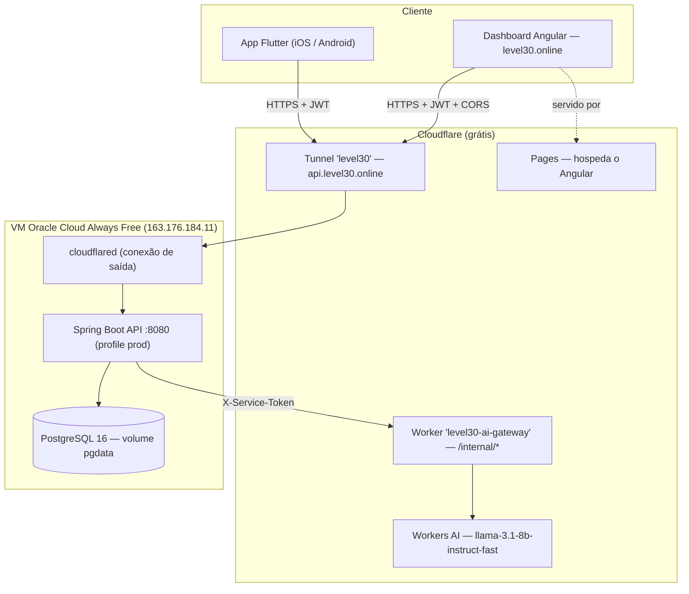

# Level30 · Smart HAS — Visão Geral + Diagnóstico do Dashboard

> Estado consolidado de tudo que existe hoje (app mobile, API, dashboard, IA, infraestrutura),
> com **foco em diagnóstico do dashboard / painel administrativo** e um **backlog de melhorias**
> para servir de base de decisão.
> Atualizado em **2026-08-30** · substitui a versão anterior.
> Documentos irmãos: [`PROJECT.md`](PROJECT.md) (mergulho técnico do app),
> [`dashboard/CHECKLIST.md`](dashboard/CHECKLIST.md) (rastreabilidade da avaliação Angular),
> [`specs/003-fase-5/`](specs/003-fase-5/) (backlog PO, contrato congelado, deploy).

---

## 1. Resumo executivo

**Level30** transforma a construção de hábitos acadêmicos num jogo de RPG: o estudante cria desafios
de ~30 dias, marca cada dia concluído, ganha XP, sobe de nível, mantém *streaks*, desbloqueia
conquistas e recebe alertas quando um desafio está em risco de abandono.

Hoje o projeto são **três aplicações sobre uma única API**, todas **no ar e conversando entre si**,
por **US$ 0/mês** de infraestrutura:

| Aplicação | Stack | Papel | No ar em |
|---|---|---|---|
| **App mobile** | Flutter (`provider`) | Experiência do estudante | iPhone (build local) · APK sob demanda |
| **API / núcleo de domínio** | Java 21 + Spring Boot 3.5 | Fonte única de verdade: auth, desafios, risco, histórico, conquistas, admin | `https://api.level30.online` |
| **Dashboard administrativo** | **Angular 18.2** (standalone) | Visão agregada do programa (coordenação) | `https://level30.online` |
| Gateway de IA | Cloudflare Worker (Hono/TS) | Único caminho até o Workers AI | `…workers.dev` (chamado só pelo backend) |

**Desde a última visão geral:** polimento de design app+dashboard (tokens unificados), **F1 ·
histórico de conclusões** (heatmap no app), **F4 · conquistas** (8 conquistas + celebração no app),
e o deploy completo em produção.

---

## 2. O que está no ar agora

| Recurso | URL | Status (verificado 2026-08-30) |
|---|---|---|
| API health | `https://api.level30.online/actuator/health` | ✅ `{"status":"UP"}` |
| API Swagger | `https://api.level30.online/swagger-ui.html` | ✅ |
| Dashboard | `https://level30.online` | ✅ Angular (Cloudflare Pages) |
| Worker de IA | `…workers.dev` | ✅ Llama respondendo |
| App no iPhone | `com.level30.level30flutter` | ✅ instalado (cert Apple ID pessoal, 7 dias) |

**Snapshot real do banco de produção (agora):** 2 usuários (`Coordenacao` = admin, `Mateus Borba
Souza`), 1 desafio (`Estudar Flutter`, categoria *study*, risco **alto 56%**), 0 concluídos,
XP médio 5, melhor streak 1. Base limpa — sem seed de estudantes.

**Verificado ponta a ponta:** login admin, `GET /admin/indicadores`, `GET /admin/usuarios`,
`GET /admin/desafios` (+ filtro `riskLevel=critical` → 0), CORS de `https://level30.online`
(preflight `200`, `access-control-allow-origin` correto), `ng build --configuration production`
(limpo, **83,5 kB** de transferência inicial estimada).

---

## 3. Arquitetura



- O **backend Java é a fonte de verdade**. App e dashboard só falam com ele.
- O **Worker** é chamado **apenas pelo backend**, servidor-a-servidor (o Workers AI só roda dentro
  do runtime da Cloudflare).
- O **contrato JSON** está **congelado** ([`specs/003-fase-5/contract.md`](specs/003-fase-5/contract.md)):
  mudanças são **aditivas**; `Challenge.fromJson` / `UserProfile.fromJson` do app não mudam.

---

## 4. App mobile (Flutter) — `lib/`

Resumo (detalhe completo em [`PROJECT.md`](PROJECT.md)):

| Área | O que faz |
|---|---|
| **Conta** | Cadastro/login e-mail+senha (JWT). Sessão em `flutter_secure_storage`. **Refresh token automático**: 401 → `POST /auth/refresh` uma vez e repete a requisição. |
| **Desafios** | Criar (título, categoria, descrição, 7–90 dias, 100–1000 XP), listar, filtrar, detalhe, **marcar o dia**, excluir (swipe). Grade de 30 dias com marcos em 7/14/21/30. |
| **Gamificação** | XP por dia · nível (500 XP) · rank (Iniciante → Lendário) · streak por desafio (pode reiniciar após 2 dias parado). |
| **F1 · Histórico** | `ActivityHeatmap` de 12 semanas no perfil (`GET /me/atividade`); histórico por desafio (`GET /challenges/{id}/historico`). *Pendente: estado "perdido" no grid de 30 dias.* |
| **F4 · Conquistas** | 8 conquistas (`Primeiro Passo`, `Semana Cheia`, `Constância`, `Maratonista`, `Poliglota`, `Madrugador`, `Resiliente`, `Veterano`). Overlay animado de celebração ao desbloquear; grade no perfil (`GET /me/conquistas`). |
| **B6 · Meu Progresso** | Tela pelo perfil (`fl_chart`): comparativo desta semana vs. anterior, XP acumulado, consistência por dia da semana, categorias (pizza), heatmap de 12 semanas. Só o aluno consigo mesmo — sem ranking. |
| **Motor de risco** | Badge de risco (0–100%) calculado localmente pelo `RiskEngine` (instantâneo, sem gastar IA). |
| **IA** | Chat "Guia do Level30" + recomendação diária, via backend → Worker → Workers AI, com fallback determinístico. |
| **Notificações · Mapa · Perfil · Onboarding · Cache offline** | Lembrete diário + alertas por risco; `flutter_map` dark; foto de perfil base64; tour de 6 passos; lista de desafios do cache local quando a rede cai. |

State management: `provider` (mantido de propósito). Providers dependem da **abstração de repositório**.

---

## 5. API — Spring Boot (`backend/`)

Java 21 · Spring Boot 3.5 · Web / Data JPA / Security / Validation / Actuator · Flyway (H2 em
dev/test, **PostgreSQL** em prod) · JWT HS256 (jjwt) + BCrypt(10) · springdoc-openapi.

Camadas: `domain → repository → service → controller`. Controller nunca acessa repository direto;
entidade JPA nunca sai do service (sempre DTO record).

### 5.1 Endpoints (contrato congelado — aditivos marcados)

| Método | Rota | Auth | Descrição |
|---|---|---|---|
| GET | `/` , `/actuator/health` | — | health |
| POST | `/auth/signup` · `/auth/login` | — | `201/200 {token, refreshToken, user}` · `user.role` aditivo (A5) · `429`+`Retry-After` (A1) |
| POST | `/auth/refresh` | — | **rotaciona** (A2): consome o refresh, devolve par novo; reuso → `401` + revoga família |
| POST | `/auth/logout` | — | **A2** — revoga a família do refresh token → `204` |
| GET | `/me` | JWT | perfil (inclui `role`) |
| GET · DELETE | `/me/sessoes` · `/me/sessoes/{id}` | JWT | **A2** — lista / encerra sessões ativas |
| PUT | `/me/avatar` | JWT | **A6** — só PNG/JPEG (magic bytes), redimensiona ≤512px, reencoda PNG; SVG → `422` |
| GET | `/challenges` | JWT | lista (mais recentes primeiro) |
| POST | `/challenges` | JWT | cria → `201` |
| POST | `/challenges/{id}/complete` | JWT | marca o dia → `{challenge, xpDelta, totalXp, conquistas[]}` *(conquistas = F4, aditivo)* |
| DELETE | `/challenges/{id}` | JWT | `204` |
| GET | `/challenges/{id}/recommendation` | JWT | `{message, riskScore, riskLevel, aiGenerated}` |
| GET | `/challenges/{id}/historico` | JWT | **F1** — `[{dayNumber, completedOn, note, xpDelta}]` |
| GET | `/me/atividade?desde=YYYY-MM-DD` | JWT | **F1** — `[{data, quantidade}]` (heatmap) |
| GET | `/me/conquistas` | JWT | **F4** — catálogo de 8 com estado `desbloqueada` |
| POST | `/challenges/{id}/replanejar/sugestao` · `/replanejar` | JWT | **C2** — sugestão (IA+fallback) e aplicação (máx 2×) |
| GET | `/programa` · POST `/programa/{id}/adotar` | JWT | **C3** — modelos do programa; adotar cria um desafio pessoal |
| GET·POST·PATCH·DELETE | `/admin/programa[/{id}]` | **ADMIN** | **C3** — CRUD dos modelos do programa |
| POST | `/chat` | JWT | `{message}` (ou `502` se o gateway de IA cair) |
| GET | `/admin/usuarios?page&size` | **ADMIN** | `Page<AdminUserResponse>` |
| GET | `/admin/desafios?riskLevel&category&page&size` | **ADMIN** | `Page<AdminChallengeResponse>` — **B1**: filtro/sort/paginação no banco (`risk_score` materializado), sem `findAll()` |
| GET | `/admin/indicadores` | **ADMIN** | KPIs agregados — **B1**: via `COUNT`/`GROUP BY` |
| GET | `/admin/metricas/{engajamento,sobrevivencia,retencao,risco,gamificacao,padroes}` | **ADMIN** | **B1** — séries agregadas para os dashboards B2/B3/B4 |

Erros sempre em `{ status, error, mensagem, detalhes[], timestamp }`.

### 5.2 Motor de risco (espelhado em 3 stacks)

`risk_engine.dart` (app) ⇄ `risk.ts` (Worker) ⇄ `RiskEngine.java` (backend). `RiskEngineTest.java`
é o contrato compartilhado.

```
score = fatorInatividade + fatorProgresso + fatorStreak   (clamp 0..1)
  inatividade: 0d→0.0 · 1→0.1 · 2→0.25 · 3+→0.40
  progresso:   (1 - currentDay/totalDays) * 0.30
  streak:      streak==0 → 0.30 · senão max(0, 0.30 - streak*0.03)
níveis: <0.25 LOW · <0.50 MEDIUM · <0.75 HIGH · >=0.75 CRITICAL
```

### 5.3 Migrations (Flyway)

| Versão | Tabela | Nota |
|---|---|---|
| `V1__init.sql` | `users`, `challenges` | base |
| `V2__challenge_completions.sql` | `challenge_completions` | **F1**. `UNIQUE (challenge_id, completed_on)` = defesa de banco contra dia duplicado. `CompletionBackfill` reconstrói histórico pré-V2. |
| `V3__user_achievements.sql` | `user_achievements` | **F4**. PK composta `(user_id, achievement_id)`. Catálogo = enum no código. |
| `V4__auth_hardening.sql` | `users.failed_attempts`, `users.locked_until` | **A1** — lockout progressivo por conta. |
| `V5__refresh_tokens.sql` | `refresh_tokens` | **A2** — `jti` PK, `family_id`, `used_at`/`revoked_at`. Rotação + detecção de reuso. |
| `V6__risk_materialization.sql` | `challenges.risk_score/risk_level` + `risk_snapshots` | **B1** — risco materializado (cache do `RiskEngine`, recalc no `complete` + job diário) + foto diária da distribuição. |
| `V7__replan_count.sql` | `challenges.replan_count` | **C2** — máx. 2 replanejamentos por desafio. |
| `V8__program_challenges.sql` | `program_challenges` + `challenges.program_challenge_id` | **C3** — modelos publicados pela coordenação; o aluno adota → desafio pessoal. |

---

## 6. Dashboard administrativo (Angular) — MAPEAMENTO COMPLETO

### 6.1 Stack e estrutura

Angular **18.2** · standalone components · builder `@angular-devkit/build-angular:application` ·
signals no `AuthService` · interceptor + guard **funcionais** · templates inline · CSS puro com
design tokens em `:root` · rotas lazy (`loadComponent`) · `zone.js` (change detection clássico com
`eventCoalescing`). **Sem NgRx, sem Tailwind, sem lib de componentes.**

```
dashboard/src/
├── index.html                    <app-root>, fonte Poppins via Google Fonts
├── styles.css                    ~195 linhas — tokens + todas as classes utilitárias
├── environments/
│   ├── environment.ts            apiBaseUrl: http://localhost:8080
│   └── environment.prod.ts       apiBaseUrl: https://api.level30.online  (fileReplacements no build prod)
└── app/
    ├── app.config.ts             provideRouter + provideHttpClient(withInterceptors([authInterceptor]))
    ├── app.routes.ts             '' → home · login · home (guard) · admin (guard) · ** → home
    ├── app.component.ts          SHELL — topbar + <router-outlet> (2 estados: autenticado / bare)
    ├── core/
    │   ├── services/
    │   │   ├── auth.service.ts        login(), signals user/isAuthenticated, localStorage
    │   │   ├── admin.service.ts       getIndicadores / getDesafios(filtro) / getUsuarios(page,size)
    │   │   └── challenge.service.ts   create(payload) / remove(id)
    │   ├── interceptors/auth.interceptor.ts   Bearer + hard-logout em 401
    │   ├── guards/admin.guard.ts              exige isAuthenticated()
    │   ├── http-error.util.ts                 apiErrorMessage(err, fallback)
    │   └── models/                            auth · user · challenge · indicadores · page  (+ index.ts)
    ├── core/services/  … + metricas.service.ts   6 GETs de /admin/metricas/* (B1)
    ├── features/
    │   ├── login/  ·  sem-acesso/ (A5)
    │   ├── home/home.component.ts          "Visão geral" (indicadores)
    │   ├── dashboards/
    │   │   ├── engajamento.component.ts    B2 — atividade, sobrevivência, retenção
    │   │   ├── risco.component.ts          B3 — distribuição, evolução, fila de intervenção
    │   │   └── gamificacao.component.ts    B4 — conquistas, níveis, streaks, XP
    │   └── admin/admin.component.ts        "Administração"
    └── shared/
        ├── pipes/rotulos.pipe.ts          CategoriaLabelPipe + RiscoLabelPipe
        ├── ui/icon.component.ts           <app-icon> — SVG inline (A8)
        └── charts/                        bar · line (single/multi/stacked) · donut · heatmap · sparkline
                                           — SVG/CSS próprios, SEM Chart.js (bundle 83 kB)
```

### 6.2 Fluxo de autenticação

1. `/login` → `AuthService.login()` → `POST /auth/login` → `persistSession()` grava
   `level30.token`, `level30.refreshToken`, `level30.user` em `localStorage` e seta o signal `_user`.
2. `authInterceptor` injeta `Authorization: Bearer <token>`; em `401` (fora de `/auth/`) tenta
   `AuthService.refreshAccessToken()` uma vez e repete a requisição (A3).
3. `adminGuard` (`canActivate` em `/home` e `/admin`) → não autenticado → `/login`; autenticado sem
   `role === 'ADMIN'` → `/sem-acesso` (A5). Shell só renderiza para `isAdmin()`.
4. Refresh falhou → `forceLogoutToLogin()`: `POST /auth/logout` (best-effort) + limpa `localStorage` + `/login`.
5. `RBAC` de fato é do servidor: `/admin/**` exige `ROLE_ADMIN` → `403` para USER.

### 6.3 Mapa de telas

#### Tela 0 · Shell (`app.component.ts`) — sempre montado

| | |
|---|---|
| **Quando** | Sempre; layout completo só quando `auth.isAdmin()` (A5). |
| **Autenticado** | `<header class="topbar">`: logo "L30" + "Level30 · Painel do Coordenador"; nav `Visão geral` · `Engajamento` · `Risco` · `Gamificação` · `Administração` com `routerLinkActive` (B7); nome do usuário (`auth.user()?.name`) + botão **Sair**. `<main><router-outlet/></main>`. |
| **Não autenticado** | Só `<main class="content--bare">` centralizado com `<router-outlet/>` (mostra o `/login`). |
| **Ações** | `Sair` → `auth.forceLogoutToLogin()`. |
| **Recursos Angular** | interpolação, `routerLink`/`routerLinkActive`, `(click)`, `*ngIf/else`. |

#### Tela 1 · `/login` (`login.component.ts`)

| | |
|---|---|
| **Layout** | `.login-card` centralizado: anel "30", título "Level30 / Painel do Coordenador", form. |
| **Campos** | `email` (type=email, `[(ngModel)]`), `password` (type=password, `[(ngModel)]`). `autocomplete` correto. |
| **Ação** | `(ngSubmit)="submit()"` → `AuthService.login({email:trim, password})` → sucesso: `router.navigate(['/home'])`. |
| **Estados** | `loading` (spinner + "Entrando…", inputs/botão `[disabled]`); `error` (`.alert-error` via `apiErrorMessage`, fallback "Nao foi possivel entrar. Verifique as credenciais."); botão `[disabled]="loading || f.invalid"`. |
| **Chamadas API** | `POST /auth/login`. |
| **Texto fixo** | "Acesso restrito à coordenação do programa." (sem credenciais expostas). |

#### Tela 2 · `/home` — "Indicadores do programa" (`home.component.ts`)

| | |
|---|---|
| **Carrega no `ngOnInit`** | `admin.getIndicadores()` **e** `admin.getDesafios({page:0, size:6})` (em paralelo). |
| **Estado loading** | spinner "Carregando indicadores…". |
| **Estado erro** | `.alert-error` + botão **Tentar de novo** (`(click)="load()"`). |
| **Estado vazio** | `vazio` = `totalDesafios === 0 && totalUsuarios <= 1` → card "Nenhum dado ainda" com explicação. |
| **Bloco KPIs** | 6 cards (`*ngFor`), cada um com `<app-icon [name]>` (SVG inline, A8): **Usuários · Desafios · Concluídos · Em risco · XP médio/usuário · Melhor streak**. |
| **Bloco "Desafios que precisam de atenção"** | dos 6 desafios de maior risco (já vêm ordenados por `riskScore` desc), filtra `high`/`critical`. Cada linha: badge de risco (cor por nível), título, aluno · categoria · dia X/Y, `riskScore` em %. Linha inteira é `[routerLink]="['/admin']"`. Some se lista vazia. |
| **Bloco "Desafios por categoria"** | barras CSS (`[style.width.%]="pct(...)"`), rótulo via `CategoriaLabelPipe`, contagem. `pct` = proporção ao **maior** valor da série (não ao total). |
| **Bloco "Desafios por nível de risco"** | idem, com cor da barra e do badge por nível de risco. |
| **Chamadas API** | `GET /admin/indicadores`, `GET /admin/desafios?page=0&size=6`. |
| **Recursos Angular** | `*ngIf` (8×), `*ngFor` (4×), interpolação, `[name]`, `[style.*]`, `[routerLink]`, pipes, `(click)`. |

#### Tela 3 · `/admin` — "Administração" (`admin.component.ts`)

Três seções empilhadas + um modal.

**3a · Desafios do programa (C3 — resolve D6)**

| | |
|---|---|
| **O que é** | A coordenação publica **modelos** de desafio; o aluno os vê no app e **adota** (cada adoção vira um desafio pessoal). O form não cria mais nada na conta do admin. |
| **Campos** (`[(ngModel)]`, hints `*ngIf`) | `title` (mín. 3), `category` (`<select>`), `description` (textarea), `totalDays` (7–90), `xpReward` (100–1000). |
| **Submit** | `(ngSubmit)="createChallenge()"` → `AdminService.criarPrograma()` → `POST /admin/programa`. |
| **Tabela de modelos** | título · categoria · duração · XP · nº de adotantes · toggle **Ativo/Arquivado** (`PATCH`) · **Excluir** (`DELETE`). |

**3b · Desafios em acompanhamento**

| | |
|---|---|
| **Carrega** | `reloadDesafios()`: `admin.getDesafios({...filtro, busca, page, size:20})` — **paginação real** prev/next (C6). |
| **Filtros** (server-side) | `category` e `riskLevel` — `<select>` com `(ngModelChange)="reloadDesafios()"`. Botão **Atualizar** manual. |
| **Busca** (server-side, C6) | param `busca` filtra título / nome / e-mail no banco (debounce 350 ms). |
| **Ordenação** (client-side, na página) | `<th>` ordenável por teclado (`tabindex`/`Enter`/`Espaço`, `aria-sort` — C6/D10) em Título, Usuário, Progresso, Streak, Risco, **Replan.** (C2). |
| **Tabela** | Título · Categoria · Usuário · Progresso · Streak · Risco (badge) · **Replan.** X/2 (C2) · **Excluir**. |
| **Rodapé** | "M desafio(s) · página X de P" + **‹ Anterior / Próxima ›**. |
| **Estados** | `loadingDesafios` (spinner); `desafiosError` (`.alert-error`); "Nenhum desafio para os filtros"; "Nenhum desafio corresponde à busca". |
| **Excluir** | botão → `deleteChallenge(d)` **só abre o modal** (`aExcluir = d`). |

**3c · Usuários**

| | |
|---|---|
| **Carrega** | `reloadUsuarios()`: `admin.getUsuarios(0, 50)`. |
| **Tabela** | Nome · E-mail · XP total · Nível · Rank · Desafios (`quantidadeDesafios`). |
| **Estados** | `loadingUsuarios` (spinner); `usuariosError` (`.alert-error`); "Nenhum usuário". |
| **Ações** | nenhuma (somente leitura). |

**3d · Modal de confirmação de exclusão**

| | |
|---|---|
| **Abre** | `*ngIf="aExcluir"`. `role="dialog" aria-modal` + foco ao abrir/retorno ao fechar + `Esc` fecha + Tab preso (C6/D10). |
| **Conteúdo** | "Excluir "título" de {aluno}? Esta ação não pode ser desfeita." |
| **Ações** | **Cancelar** (`aExcluir = null`) · **Excluir** (`confirmarExclusao()` → `ChallengeService.remove(id)` → `DELETE /challenges/{id}` → `reloadDesafios()`). `deletingId` trava o botão da linha durante a chamada. |

**Chamadas API da tela `/admin`:** `GET/POST/PATCH/DELETE /admin/programa`, `GET /admin/desafios` (+`busca`/`page`),
`GET /admin/usuarios` (+`page`), `DELETE /challenges/{id}`.

### 6.4 Camada de dados

| Arquivo | Responsabilidade | Observações |
|---|---|---|
| `auth.service.ts` | `login()`, `refreshAccessToken()` (A3), signals `user` / `isAuthenticated` / `isAdmin`, `persistSession/logout/forceLogoutToLogin`. | Refresh token agora é usado e rotacionado (A2/A3). `forceLogoutToLogin` revoga no servidor. |
| `admin.service.ts` | GETs de `/admin/**` (indicadores, desafios com `busca`/`page`, usuários) + CRUD de `/admin/programa` (C3). | — |
| `challenge.service.ts` | `remove()` (usado no modal de exclusão). `create()` não é mais chamado pelo dashboard. | — |
| `auth.interceptor.ts` | Bearer + `catchError` → `401` → refresh 1× → repete; falhou → `forceLogoutToLogin()` (A3). | — |
| `admin.guard.ts` | não autenticado → `/login`; autenticado sem ADMIN → `/sem-acesso` (A5). | — |
| `shared/ui/icon.component.ts` | `<app-icon [name]>` — SVG inline, sem `bypassSecurityTrust` (A8). | — |
| `http-error.util.ts` | `apiErrorMessage()` — lê `body.mensagem ?? body.error ?? fallback`; `status 0` cita `environment.apiBaseUrl` (C6). | — |
| `models/*` | Interfaces espelhando o contrato: `AuthResponse`, `ApiError`, `User`, `AdminUser`, `Challenge`, `CreateChallengeRequest`, `AdminChallenge`, `Indicadores`, `Distribuicao`, `Page<T>`, `Category`, `RiskLevel`. | `Page<T>` só declara `content/totalElements/totalPages/number/size` (o backend manda mais campos, ignorados). |
| `rotulos.pipe.ts` | Traduz `health→Saúde`, `low→Baixo` etc. **só para exibição** — o valor enviado à API continua cru. | — |

### 6.5 Design system (`styles.css`)

Tokens idênticos a `lib/core/constants/app_colors.dart`:
`--bg #080a17` · `--surface #111328` · `--surface-2 #171a33` · `--border #232744` ·
`--accent #00ff9c` · `--accent-ink #052e1e` · `--text #ffffff` · `--text-dim #8a90b8` ·
risco `#22c55e / #eab308 / #f97316 / #ef4444`. Fonte **Poppins**.

Classes-chave: `.topbar/.brand/.nav`, `.card`, `.grid/.two-col/.kpi-grid`, `.kpi/.kpi-icon`,
`.attn-row`, `.bar-row/.bar-track/.bar-fill`, `.field` (label+input), `.btn-primary/.btn-ghost/.btn-danger`,
`.table-wrap` (scroll-x), `.modal-backdrop/.modal`, `.badge`, `.alert-error/.alert-success`,
`.state/.state-empty`, `.spinner`. Responsivo em `@media (max-width: 640px)` (topbar quebra) e
`860px` (`.two-col` vira coluna).

---

## 7. Diagnóstico do dashboard

Nada aqui é bug que quebra a demo — tudo funciona. São dívidas e divergências com o app / o contrato,
ordenadas por impacto.

### 7.1 Achados

| # | Severidade | Achado | Detalhe / impacto |
|---|---|---|---|
| **D1** | ✅ **Resolvido (A3)** | Interceptor agora tenta `POST /auth/refresh` uma vez no `401` (com `shareReplay` para 401 simultâneas), repete a requisição e só desloga se o refresh falhar. Backend faz **rotação com detecção de reuso** (A2). | — |
| **D2** | ✅ **Resolvido (A5)** | `UserResponse` ganhou `role` (aditivo); `adminGuard` exige `isAdmin()`; não-ADMIN vai para `/sem-acesso`. Servidor continua sendo a autoridade (`403`). | — |
| **D3** | ✅ **Resolvido (C6)** | Mensagem de `status 0` usa `environment.apiBaseUrl` e acentuação correta (era ":8080" hardcoded + mojibake). | — |
| **D4** | ✅ **Resolvido (C6)** | Paginação real (prev/next, size 20) em desafios e usuários; busca movida para o servidor. Ordenação segue client-side na página (rotulada como tal). | — |
| **D5** | ✅ **Resolvido (C5)** | `karma.conf.js` (ChromeHeadless) + 22 specs: `apiErrorMessage`, `AuthService`, `AdminService`, `authInterceptor` (Bearer + refresh em 401), `adminGuard`. `npm test` no CI (`.github/workflows/ci.yml`). | — |
| **D6** | ✅ **Resolvido (C3)** | O form de `/admin` virou **"Desafios do programa"**: publica modelos (`program_challenges`) que o aluno vê no app e **adota** (`POST /programa/{id}/adotar` → desafio pessoal). Não cria mais nada na conta do admin. | — |
| **D7** | ✅ **Resolvido (B1)** | Risco **materializado** em `challenges.risk_score/risk_level` (recalc no `complete` + job diário; `RiskEngine` = fonte única da fórmula). `/admin/desafios` = query paginada com `JOIN FETCH user` (sem N+1); `/admin/indicadores` = `COUNT`/`GROUP BY`. | — |
| **D8** | ✅ **Resolvido (B4/B6)** | Dashboard de **Gamificação** (conquistas, níveis, streaks) + **Meu Progresso** no app. F1/F4 agora têm superfície visual. | Linha do tempo de conclusão por aluno no `/admin` ainda não — item C. |
| **D9** | 🟢 Nota | **`environment.ts` de dev aponta `localhost:8080`.** `npm start` sem backend local → toda tela cai no erro de conexão (o do D3). | Esperado, mas quem for mexer no dashboard precisa subir o backend ou trocar para `api.level30.online`. |
| **D10** | ✅ **Resolvido (A8/C6)** | `aria-hidden` nos SVG · `<th scope>` + `aria-sort` + teclado nas colunas · modal `role="dialog"` + `Esc` + foco preso. Falta só a auditoria responsiva 375/768/1280. | — |

> **A8** também eliminou o `DomSanitizer.bypassSecurityTrustHtml` — os 6 ícones de KPI agora são
> `<app-icon>` (SVG inline, `src/app/shared/ui/icon.component.ts`). Zero `bypassSecurityTrust*` no dashboard.

### 7.2 O que está sólido

- **HttpClient 100% encapsulado em services** — nenhum componente injeta `HttpClient` (checklist 3.3).
- **Contrato respeitado** — models espelham `contract.md`; pipes traduzem só na exibição, sem alterar o payload.
- **Estados de UI completos** — loading / erro / vazio / sucesso em todas as telas; retry no `/home`.
- **Bundle enxuto** — 83,5 kB de transferência inicial, rotas lazy, budgets configurados no `angular.json`.
- **Design alinhado ao app** — mesmos tokens, mesma fonte, mesma linguagem visual.
- **Build de produção limpo** — `fileReplacements` troca o `environment` corretamente.

---

## 8. Gateway de IA — Cloudflare Worker (`server/`)

Deixou de ser backend (tinha D1 + auth) e virou **só o gateway de IA**:

| Rota | Auth | Descrição |
|---|---|---|
| `POST /internal/recommendation` | `X-Service-Token` | `{title, category, currentDay, totalDays, streak, riskLevel}` → `{message, aiGenerated}`. Nunca falha: sem IA, devolve o fallback do nível de risco. |
| `POST /internal/chat` | `X-Service-Token` | `{system, message, history}` → `{message}` ou `502`. |
| rotas legadas | — | respondem `503` (inertes, mantidas no código). |

Modelo: `@cf/meta/llama-3.1-8b-instruct-fast`. Deploy: `wrangler deploy` (conta `mateusborbasouza@gmail.com`).

---

## 9. Banco de dados

**PostgreSQL 16** em container na VM, schema por **Flyway** (`V1`/`V2`/`V3`), volume Docker `pgdata`
(sobrevive a restart/reboot).

- **`users`** — `id (UUID)`, `email` unique, `password_hash` (BCrypt), `name`, `total_xp`,
  `avatar` (data URI, nullable), `role` (`USER`/`ADMIN`), `created_at`.
- **`challenges`** — `id`, `user_id` FK `ON DELETE CASCADE`, `title` (≥3), `category`
  (`HEALTH/STUDY/PRODUCTIVITY/MINDFULNESS/FITNESS` — JSON em minúsculas), `description`,
  `total_days` (7–90), `current_day`, `xp_reward` (100–1000), `streak`, `last_activity_at`, `created_at`.
- **`challenge_completions`** (F1) — `challenge_id` FK, `day_number`, `completed_on` (date),
  `note`, `xp_delta`. `UNIQUE (challenge_id, completed_on)`.
- **`user_achievements`** (F4) — `user_id`, `achievement_id`, `unlocked_at`. PK `(user_id, achievement_id)`.

**Estado:** `SEED_ENABLED=false` → base limpa. `DataSeeder.ensureAdmin()` garante a conta
`Coordenacao` (`admin@level30.online`, `ROLE_ADMIN`) em todo boot. Ana/Bruno/Carla só com `SEED_ENABLED=true`.

---

## 10. Segurança

- **Senha:** BCrypt força 10. **Sessão:** JWT HS256, access 1h, refresh **7d** (A2), `STATELESS`.
- **`JWT_SECRET`:** só por variável de ambiente.
- **Refresh token (A2):** rastreado em `refresh_tokens` (`jti`/`family_id`), **rotação a cada uso** com
  **detecção de reuso** (reapresentar um token consumido revoga a família inteira). `POST /auth/logout`
  e `GET·DELETE /me/sessoes` revogam de fato. Expurgo diário dos vencidos.
- **Força bruta (A1):** rate limit 10 req/60 s por IP em `/auth/**` (`CF-Connecting-IP` atrás do túnel);
  lockout progressivo por conta (1/5/15/60 min) a partir da 5ª falha; tempo de resposta uniforme quando
  o e-mail não existe (anti-enumeração). `429` + `Retry-After`.
- **RBAC:** `/admin/**` exige `ROLE_ADMIN` (`@PreAuthorize` no `AdminController`) — servidor. No cliente,
  `adminGuard` também checa `role === 'ADMIN'` (A5). USER → `403`, sem token → `401`.
- **Headers (A7):** API responde CSP (`default-src 'none'` fora do Swagger), HSTS, `nosniff`,
  `frame-ancestors 'none'`, `Referrer-Policy`, `Permissions-Policy`; header `Server` removido.
  Dashboard: `dashboard/public/_headers` (CSP, HSTS, etc. no Cloudflare Pages).
- **Upload de avatar (A6):** allowlist PNG/JPEG por magic bytes, reencode server-side (descarta payload), SVG barrado.
- **CORS restrito:** `CORS_ORIGINS = https://level30.online,https://www.level30.online` (verificado).
- **Worker:** `/internal/*` por `X-Service-Token` compartilhado.
- **VM:** sem porta aberta — `cloudflared` faz conexão de saída; acesso só por SSH (chave).
- **Erros:** `GlobalExceptionHandler` nunca expõe stack trace.
- **CI:** `secret-scan.yml` (gitleaks) bloqueia segredo no PR; `.gitignore` varre `.env`/`*.key`/etc.

---

## 11. Infraestrutura / Deploy (US$ 0/mês)

| Componente | Onde | Como |
|---|---|---|
| API + Postgres | VM Oracle Cloud Always Free `163.176.184.11` (AMD E2.1.Micro, ~1 GB RAM + 4 GB swap) | `deploy/docker-compose.yml`: `postgres` + `api` (jar) + `cloudflared`. Jar buildado no Mac e copiado (VM não roda Maven → `backend/Dockerfile.runtime`). `-Xmx320m` na API, Postgres tunado, `mem_limit` em tudo. |
| Exposição da API | Cloudflare Tunnel `level30` → `api.level30.online` | Sem porta aberta na VM. TLS automático. |
| Dashboard | Cloudflare Pages `level30-flutter` | Repo GitHub, branch `main`, root `dashboard`, build `npm run build -- --configuration production`, output `dist/dashboard/browser`. Domínio `level30.online`. |
| Worker de IA | Cloudflare Workers | `wrangler deploy` (conta `mateusborbasouza@gmail.com`). |
| Domínio | `level30.online` (Hostinger) | Nameservers → Cloudflare (Free). |

### Operar / atualizar

```bash
ssh -i ~/Downloads/ssh-key-2026-08-30.key ubuntu@163.176.184.11
cd ~/Level30-Flutter/deploy && sudo docker compose ps
sudo docker compose logs -f api
# atualizar backend:
#   Mac:  cd backend && JAVA_HOME=$(/usr/libexec/java_home -v 21) mvn -q clean package -DskipTests
#   scp backend/target/level30-api-*.jar ubuntu@163.176.184.11:~/Level30-Flutter/backend/target/
#   VM:   cd ~/Level30-Flutter && git pull && cd deploy && sudo docker compose up -d --build
# dashboard: git push → Cloudflare Pages faz o build/deploy automático.
```

---

## 12. Credenciais

| Uso | Valor |
|---|---|
| Dashboard (`https://level30.online`) | `admin@level30.online` / `L30adm-c44215d9` |
| App / estudantes | criar conta pela tela de cadastro (sem seed de estudantes) |

> A credencial do dashboard fica **de propósito** neste documento: o repositório é público para
> a correção acadêmica e o professor precisa entrar no painel. É uma conta de demonstração num
> ambiente descartável. Os **segredos de infra** (`JWT_SECRET`, `DB_PASSWORD`, `AI_SERVICE_TOKEN`,
> `TUNNEL_TOKEN`) continuam **apenas** no `~/Level30-Flutter/deploy/.env` da VM.

> ⚠️ **Política de testes:** smoke tests de endpoints rodam contra o **backend local**
> (`localhost:8080`), **nunca** contra `api.level30.online` — para não poluir a base de produção.
> Diagnóstico read-only (GET como admin) em produção é aceitável.

---

## 13. Testes

| Suíte | Cobre | Resultado |
|---|---|---|
| `backend/` `RiskEngineTest` | Fórmula do risco + fronteiras | 8/8 |
| `backend/` `ChallengeServiceTest` | Dia duplicado → 409, reset de streak, xpDelta atômico, ownership → 404, F1 histórico, F4 conquistas | ✅ |
| `backend/` `AuthFlowTest` | signup/login/`/me`, 409, 401, 403 USER em `/admin` | 6/6 |
| `backend/` `AuthRateLimiterTest` · `AuthIpRateLimitTest` · `AuthLockoutTest` | **A1** — janela por IP, `429`, lockout progressivo, reset no sucesso | ✅ |
| `backend/` `RefreshRotationTest` | **A2** — rotação, reuso → revoga família, logout, `/me/sessoes` | 4/4 |
| `backend/` `AvatarValidationTest` | **A6** — PNG ok, SVG/não-imagem → 422, não-data-URI → 400 | 4/4 |
| `backend/` `MetricasTest` | **B1/C6** — risco materializado, `/admin/indicadores` sem `findAll()`, 6 métricas, `/me/atividade` com `xp`, busca server-side, RBAC | 7/7 |
| `backend/` `ChallengeServiceTest` (+C4) | nota opcional de conclusão gravada/normalizada | ✅ |
| `test/risk_engine_test.dart` | Motor de risco no app (10 casos) | ✅ |
| `test/challenge_provider_test.dart` | `ChallengeProvider` com fake repo | 7/7 |
| `test/integration/backend_smoke_test.dart` | Camada de dados do app vs. backend real (opt-in `BACKEND_IT=true`) | 3/3 |
| `dashboard/` `npm test` | **C5** — `apiErrorMessage`, `AuthService`, `AdminService`, `authInterceptor`, `adminGuard` (Karma/ChromeHeadless) | 22/22 |
| `backend/` `ReplanServiceTest` · `ProgramaTest` | **C2/C3** — replan (máx 2×, xpReward recalc), adoção de modelo (409/400), CRUD admin | 9/9 |

`mvn test` → **52/52** · `flutter test` → 17 + 1 skip · `npm test` (dashboard) → **22/22** ·
`ng build --configuration production` → limpo (~84 kB). CI: `.github/workflows/ci.yml` roda os três.

> ⚠️ **Build local:** `JAVA_HOME=/opt/homebrew/opt/openjdk@21` (o `java_home -v 21` passou a resolver
> Temurin 25, incompatível com o Lombok — daria "cannot find symbol" em massa).

---

## 14. Estrutura do repositório

```
Level30-Flutter/
├── lib/                    App Flutter (Dart)
├── android/  ios/          Plataformas nativas
├── test/                   Testes do app (+ test/integration/)
├── backend/                API Spring Boot (Java) — ~65 arquivos .java
│   ├── src/main/java/com/level30/api/
│   ├── src/main/resources/  application*.yml + db/migration/ (V1, V2, V3)
│   ├── Dockerfile            multi-stage (build no container)
│   └── Dockerfile.runtime    só copia o jar pronto (VM de 1 GB)
├── dashboard/              Dashboard Angular (TypeScript)
│   └── CHECKLIST.md        rastreabilidade dos 9 requisitos Angular → arquivo:linha
├── server/                 Cloudflare Worker — gateway de IA (Hono/TS)
├── deploy/                 docker-compose.yml + .env.example
├── specs/003-fase-5/       backlog-po.md · contract.md · STATUS.md · deploy-oracle.md
├── PROJECT.md              Mergulho técnico do app
└── VISAO-GERAL.md          Este documento
```

`agents/` na raiz é um repositório git separado (material de apoio) — fora do build.

---

## 15. Backlog de melhorias (base de decisão)

Priorizado por relação impacto/esforço. Dashboard primeiro (foco deste documento).

> **CONCLUÍDO** (branch `seguranca/bloco-1`, `mvn test` 52 · `flutter test` 17+1 · `npm test` 22 · `ng build` ~84 kB):
>
> - **Segurança (Bloco 1):** A1 força bruta · A2 ciclo do refresh token · A3 refresh no dashboard ·
>   A5 guard de papel · A6 avatar · A7 headers · A8 sem `bypassSecurityTrust`.
> - **Dashboards (Parte B):** B1 endpoints agregados + risco materializado · B2 Engajamento ·
>   B3 Risco · B4 Gamificação · B6 "Meu Progresso" (app) · B7 navegação. Gráficos SVG próprios (sem Chart.js).
> - **Funcionalidades / qualidade (Parte C):** C1 estado "atrasado" no grid + cores + `StatTile` + slider ·
>   **C2 replanejamento assistido por IA** (F2) · **C3 desafios do programa** (F3, resolve D6) ·
>   C4 notas de conclusão · C5 22 specs do dashboard + `ci.yml` · C6 (D3/D4/D9/D10).
>
> **Não feito:** B5 (auditoria, depende de A10) · exibir notas de conclusão + injetá-las no prompt da IA.
> **Resto da Parte A dispensado:** credencial pública de propósito; MFA/senha via **Auth0** (planejado); A10–A12 depois.

### 15.1 Dashboard — correções rápidas (baixo esforço)

| Item | Origem | Estado |
|---|---|---|
| Mensagem de `status 0` em `http-error.util.ts` (usa `environment.apiBaseUrl`, acentuação) | D3 | ✅ C6 |
| `adminGuard` também checar `role === 'ADMIN'` | D2 | ✅ A5 |
| `aria-hidden` nos SVG | D10 | ✅ A8 |
| `<th scope="col">`, `aria-sort`, teclado nas colunas, modal com `Esc`/foco preso | D10 | ✅ C6 |

### 15.2 Dashboard — funcionalidades (médio esforço)

| Item | Origem | Nota |
|---|---|---|
| **Refresh-token no interceptor** | D1 | ✅ A3 |
| **Paginação real** em `/admin` | D4 | ✅ C6 — prev/next + busca server-side; ordenação ainda client-side na página |
| **Dashboard de Gamificação / Meu Progresso** | D8 | ✅ B4 / B6 |
| **Linha do tempo de conclusões** no `/admin` (por aluno) | D8 / F1 | ⬜ precisa endpoint admin de histórico |
| **Exibir notas de conclusão** (histórico) + injetá-las no prompt da IA | C4 | ⬜ capturadas e salvas, ainda não exibidas |

### 15.3 Dashboard — qualidade

| Item | Origem | Estado |
|---|---|---|
| Karma/Jasmine + specs (services, interceptor, guard, `apiErrorMessage`) | D5 | ✅ C5 (22 specs) + `ci.yml` |
| Auditoria responsiva 375 / 768 / 1280 | D10 | ⬜ |

### 15.4 Backend — impacta o dashboard

| Item | Origem | Estado |
|---|---|---|
| `/admin/desafios` paginado no banco + `fetch join` do `user` (N+1) | D7 | ✅ B1 |
| `/admin/indicadores` via `GROUP BY` | D7 | ✅ B1 |
| Materializar `riskLevel` | D7 | ✅ B1 (`V6`, job diário) |
| Endpoint admin de histórico de conclusão por aluno (F1) | D8 / spec | ⬜ |
| Endpoint de replanejamento (F2) | spec | ⬜ |

### 15.5 App / produto (fora do dashboard, do `specs/003-fase-5`)

- **F1 leftover:** estado "perdido" no grid de 30 dias do `challenge_detail_screen`.
- **F2 · Replanejamento assistido por IA** — ✅ C2.
- **F3 · Desafios do programa** — ✅ C3 (resolve D6).
- **F5–F8** — escudo de streak, conclusão offline com fila, padrões de comportamento, push FCM.
- **Design:** `AppColors.primary` migrado e removido · `_StatChip` → `StatTile` · slider com valor na bolha (C1).

---

## 16. O que falta (entregáveis acadêmicos — E4)

| Item | Estado |
|---|---|
| Documentação em **PDF** (justificativa da stack, roadmap, backend, dashboard) | ⬜ — este `.md` + `PROJECT.md` + `specs/` cobrem o conteúdo |
| **Slides** (≤ 10, nome/RM/foto de cada integrante) | ⬜ |
| **Vídeo** no YouTube não listado (≤ 5 min, app rodando) | ⬜ |
| Repositório GitHub com acesso liberado | ✅ |

Tudo o que é software está **pronto, testado e no ar**. Falta empacotar a entrega e atacar o backlog acima.
