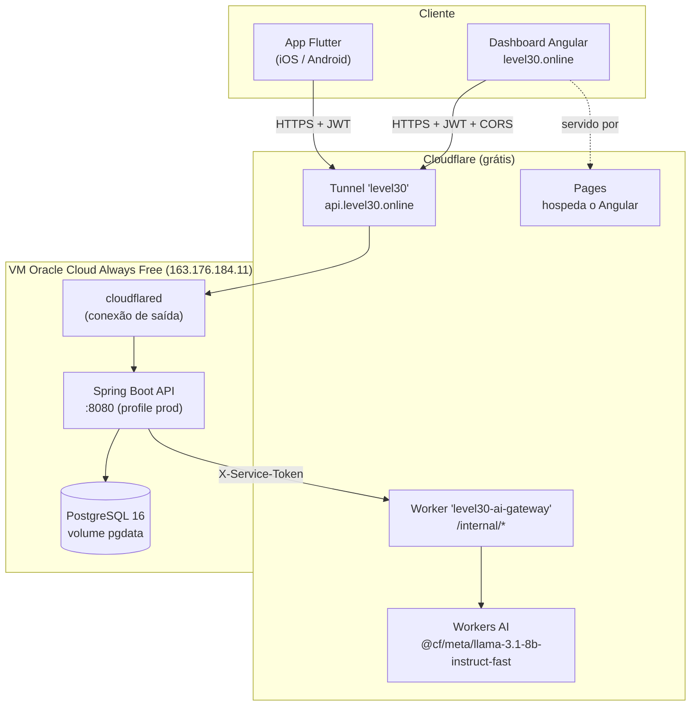

# Level30 · Smart HAS — Visão Geral do Projeto (Fase 5)

> Estado consolidado de tudo que existe hoje: app mobile, API, dashboard, IA e infraestrutura.
> Atualizado em **2026-08-30**. Documentos irmãos: [`PROJECT.md`](PROJECT.md) (mergulho técnico do app),
> [`specs/003-fase-5/`](specs/003-fase-5/) (backlog, contrato, deploy).

---

## 1. Resumo executivo

**Level30** transforma a construção de hábitos acadêmicos num jogo de RPG: o usuário cria desafios
de 30 dias, marca cada dia concluído, ganha XP, sobe de nível, mantém *streaks* e recebe alertas
quando um desafio está em risco de abandono.

Na **Fase 5** (atividade FIAP "Mobile Hybrid App e a Sociedade 5.0"), o projeto passou a ser
**três aplicações sobre uma única API**, todas **no ar e conversando entre si**:

| Aplicação | Stack | Papel | Está no ar em |
|---|---|---|---|
| **App mobile** | Flutter (`provider`) | Experiência do estudante | iPhone de Mateus (build local) · APK sob demanda |
| **API / núcleo de domínio** | **Java 21 + Spring Boot 3.5** | Fonte única de verdade: auth, desafios, risco, admin | `https://api.level30.online` |
| **Dashboard administrativo** | **Angular 18** | Visão agregada do programa (coordenação) | `https://level30.online` |
| Gateway de IA | Cloudflare Worker (Hono/TS) | Único caminho até o Workers AI | `https://level30-ai-gateway.mateusborbasouza.workers.dev` |

**Custo de infraestrutura: US$ 0/mês.**

---

## 2. O que está no ar agora

| Recurso | URL | Status |
|---|---|---|
| API (health) | `https://api.level30.online/actuator/health` | ✅ `{"status":"UP"}` |
| API (Swagger) | `https://api.level30.online/swagger-ui.html` | ✅ |
| Dashboard | `https://level30.online` | ✅ Angular servido |
| Worker de IA | `https://level30-ai-gateway.mateusborbasouza.workers.dev` | ✅ Workers AI (Llama) respondendo |
| App no iPhone | `com.level30.level30flutter` | ✅ instalado (assinado com Apple ID pessoal, validade 7 dias) |

**Verificado ponta a ponta:** login, `/admin/**`, CORS de `https://level30.online`, chat e recomendação
com `aiGenerated: true` (fluxo Spring → Worker → Workers AI), RBAC, e teste de integração do app
Flutter contra o backend real (3/3).

---

## 3. Arquitetura



- O **backend Java é a fonte de verdade** — auth, desafios, XP, risco. O app e o dashboard só falam
  com ele.
- O **Worker** é chamado **apenas pelo backend**, servidor-a-servidor, para gerar texto de IA
  (o Workers AI só roda dentro do runtime da Cloudflare).
- O **Cloudflare Tunnel** expõe a VM sem abrir nenhuma porta nela (conexão de saída do `cloudflared`).
- O **contrato JSON** entre backend e clientes está **congelado** ([`specs/003-fase-5/contract.md`](specs/003-fase-5/contract.md)):
  o app Flutter roda **sem alterar** `Challenge.fromJson` / `UserProfile.fromJson`.

---

## 4. App mobile (Flutter) — `lib/`

### 4.1 Funcionalidades

| Área | O que faz |
|---|---|
| **Conta** | Cadastro e login por e-mail/senha (JWT). Sessão persistida em `flutter_secure_storage`. **Refresh token automático**: ao receber 401, o `ApiClient` tenta `POST /auth/refresh` uma vez e repete a requisição — o usuário não é deslogado à toa. |
| **Desafios** | Criar (título, categoria, descrição, duração 7–90 dias, XP 100–1000), listar, filtrar por categoria, ver detalhe, **marcar o dia de hoje**, excluir (swipe). Grade visual dos 30 dias, marcos em 7/14/21/30. |
| **Gamificação** | XP por dia concluído · nível (500 XP/nível) · rank (Iniciante → Lendário) · streak por desafio (pode **reiniciar** após 2 dias parado). |
| **Motor de risco** | Cada card mostra um *badge* de risco (0–100%) calculado localmente pelo `RiskEngine` (resposta instantânea, sem gastar IA). |
| **Assistente de IA** | Chat "Guia do Level30" (mentor de RPG) com respostas contextualizadas nos dados reais do jogador. Recomendação diária por desafio. Ambos via backend → Worker → Workers AI, com fallback determinístico. |
| **Notificações** | Lembrete diário agendado (horário configurável) + alertas disparados por nível de risco. Android e iOS. |
| **Mapa** | `flutter_map` (tiles dark CartoDB) com os desafios espalhados ao redor da localização real; zona de risco destacada. |
| **Perfil** | Foto (câmera/galeria → base64 → backend), anel de XP, grid de stats, marcos, "rever tour". |
| **Onboarding** | Tour interativo de 6 passos (`showcaseview`) no primeiro uso. |
| **Cache offline** | Se a rede cair, a lista de desafios vem do cache local (`shared_preferences`) com banner "Exibindo dados salvos localmente". |
| **Integrações externas** | Clima (Open-Meteo) e citação motivacional (ZenQuotes) na Home. |

### 4.2 Telas (`lib/presentation/screens/`)

`SplashScreen` → `LoginScreen` → `HomeScreen` (dashboard do estudante) · `CreateChallengeScreen` ·
`ChallengeDetailScreen` · `MapScreen` · `NotificationsScreen` · `ProfileScreen` · `ChatScreen`.

### 4.3 Arquitetura interna

```
lib/
├── core/          constantes (cores, tema dark, app_config), extensions
├── data/
│   ├── model/     Challenge, UserProfile, ChatMessage, RiskAssessment
│   ├── repository/ ChallengeRepository, UserRepository (abstrato + impl)  ← camada nova (Fase 5)
│   └── service/   ApiClient (c/ refresh token), ChallengeCache, Notification/Quote/Weather/Onboarding
├── domain/
│   ├── engine/    RiskEngine (regra pura — espelho de risk.ts e RiskEngine.java)
│   └── provider/  ChallengeProvider, UserProvider, ChatProvider, NotificationProvider
└── presentation/  screens/ + widgets/
```

- **State management:** `provider` (mantido de propósito — a Fase 5 evoluiu a base, não reescreveu).
- Providers dependem da **abstração de repositório**, não do `ApiClient` → testáveis com fakes.
- `lib/core/constants/app_config.dart` → `apiBaseUrl` default `https://api.level30.online`
  (override: `flutter run --dart-define=API_BASE_URL=http://localhost:8080`).

### 4.4 Rodar

```bash
flutter pub get
flutter run                              # usa api.level30.online
flutter run --dart-define=API_BASE_URL=http://localhost:8080   # backend local
flutter test                             # 17 testes + 1 skip
flutter analyze                          # limpo (só infos de const pré-existentes)

# iOS (device conectado, Team de assinatura já configurado):
flutter build ios --release
flutter install --release -d <device-id>
```

---

## 5. API — Spring Boot (`backend/`)

### 5.1 Stack e camadas

Java 21 · Spring Boot 3.5 · Spring Web / Data JPA / Security / Validation / Actuator ·
Flyway (H2 em dev/test, **PostgreSQL** em prod) · JWT HS256 (jjwt) + BCrypt(10) · springdoc-openapi.

```
com.level30.api
├── domain/model      entidades (User, Challenge) + enums (Category, RiskLevel, SuggestedAction, Role)
├── domain/engine     RiskEngine.java   ← espelho de risk.ts / risk_engine.dart
├── domain/Leveling   nível/rank (500 XP/nível)  ← espelho de UserProfile
├── repository        Spring Data JPA
├── dto/request,resp  records — o contrato de entrada/saída
├── service           Auth, Challenge, User, Chat, AiGateway, Admin
├── controller        Auth, User, Challenge, Chat, Admin, Root
├── security          JwtService, JwtAuthFilter, AuthPrincipal, RestAuthErrorHandlers
├── config            SecurityConfig, OpenApiConfig, EnumConverters, DataSeeder
└── exception         GlobalExceptionHandler + exceções de domínio
```

Regra de dependência: `domain → repository → service → controller`. Controller nunca acessa
repository direto; entidade JPA nunca sai do service (sempre DTO).

### 5.2 Endpoints (contrato congelado — ver `specs/003-fase-5/contract.md`)

| Método | Rota | Auth | Descrição |
|---|---|---|---|
| GET | `/` , `/actuator/health` | — | health |
| POST | `/auth/signup` | — | cria conta → `201 {token, refreshToken, user}` |
| POST | `/auth/login` | — | `{token, refreshToken, user}` |
| POST | `/auth/refresh` | — | troca refresh por novo access token |
| GET | `/me` | JWT | perfil |
| PUT | `/me/avatar` | JWT | foto (data URI, ≤ 400 KB) |
| GET | `/challenges` | JWT | lista (mais recentes primeiro) |
| POST | `/challenges` | JWT | cria → `201` |
| POST | `/challenges/{id}/complete` | JWT | marca o dia → `{challenge, xpDelta, totalXp}` |
| DELETE | `/challenges/{id}` | JWT | `204` |
| GET | `/challenges/{id}/recommendation` | JWT | `{message, riskScore, riskLevel, aiGenerated}` |
| POST | `/chat` | JWT | `{message}` (ou `502` se o gateway de IA cair) |
| GET | `/admin/usuarios` | **ADMIN** | `Page<AdminUserResponse>` |
| GET | `/admin/desafios` | **ADMIN** | `Page`, filtros `riskLevel` / `category` |
| GET | `/admin/indicadores` | **ADMIN** | KPIs agregados do dashboard |

Erros sempre em `{ status, error, mensagem, detalhes[], timestamp }` (o campo `error` existe para
o `ApiClient` do Flutter, que lê `body['error']`).

### 5.3 Motor de risco (`RiskEngine.java`)

**Fórmula idêntica** em três implementações: `risk_engine.dart` (app) ⇄ `risk.ts` (Worker) ⇄
`RiskEngine.java` (backend). `RiskEngineTest.java` é o contrato compartilhado (portado de
`test/risk_engine_test.dart`).

```
score = fatorInatividade + fatorProgresso + fatorStreak   (clamp 0..1)
  inatividade:  0 dias→0.0 · 1→0.1 · 2→0.25 · 3+→0.40
  progresso:    (1 - currentDay/totalDays) * 0.30
  streak:       streak == 0 → 0.30 · senão max(0, 0.30 - streak*0.03)
níveis:  <0.25 LOW · <0.50 MEDIUM · <0.75 HIGH · >=0.75 CRITICAL
ação:    dia ∈ {7,14,21,30} → CELEBRATE_MILESTONE
         senão  LOW→NONE · MEDIUM→SEND_REMINDER · HIGH→SEND_MOTIVATION · CRITICAL→SUGGEST_REPLAN
```

### 5.4 Regras de negócio corrigidas na Fase 5

| Regra | Comportamento |
|---|---|
| **Dia duplicado** | 2º `complete` no mesmo dia (fuso `America/Sao_Paulo`) → **HTTP 409**. |
| **Reset de streak** | Última atividade = ontem → `streak + 1`. ≥ 2 dias atrás ou nunca → `streak = 1`. |
| **XP atômico** | `xpDelta = earnedXp(dia+1) - earnedXp(dia)`, `earnedXp` por **divisão inteira**; challenge + `users.total_xp` na **mesma transação** (`@Transactional`). |
| **Ownership** | Todo acesso a `/challenges/{id}` valida dono → `404` (não `403`, não vaza existência). |

### 5.5 Rodar

```bash
cd backend
JAVA_HOME=$(/usr/libexec/java_home -v 21) mvn spring-boot:run   # :8080, Swagger em /swagger-ui.html
JAVA_HOME=$(/usr/libexec/java_home -v 21) mvn test               # 20/20
```

Variáveis de ambiente (prod): `JWT_SECRET`, `DB_URL`/`DB_USER`/`DB_PASSWORD`, `CORS_ORIGINS`,
`AI_WORKER_URL`, `AI_SERVICE_TOKEN`, `SEED_ENABLED`, `SEED_ADMIN_EMAIL`/`SEED_ADMIN_PASSWORD`,
`SPRING_PROFILES_ACTIVE=prod`.

---

## 6. Dashboard administrativo (Angular) — `dashboard/`

Angular 18 *standalone components* · `authInterceptor` (Bearer + logout em 401) · `adminGuard` ·
3 services que concentram **todo** o HTTP (nenhum componente injeta `HttpClient`).

| Rota | Conteúdo |
|---|---|
| `/login` | Formulário e-mail/senha (`[(ngModel)]`, `(ngSubmit)`), erro com `*ngIf`. |
| `/home` | **Indicadores do programa**: 6 KPIs (usuários, desafios, concluídos, em risco, XP médio, melhor streak) + distribuição por categoria e por nível de risco (barras CSS, semáforo de cores). |
| `/admin` | Tabela de desafios (`*ngFor`) com filtros por categoria/risco e badge de risco dinâmico · **formulário de criação de desafio** · exclusão com confirmação · tabela de usuários (XP, nível, nº de desafios). |

Todos os dados vêm de `GET /admin/**` — **query real no PostgreSQL, sem mock** (`grep mock` no
código → zero). `dashboard/CHECKLIST.md` mapeia os 9 requisitos da avaliação Angular para
arquivo:linha. Identidade visual alinhada ao app (paleta `#080A17`/`#111328`/`#00FF9C`, Poppins).

```bash
cd dashboard && npm ci && npm start          # :4200 (aponta pra api.level30.online)
npm run build -- --configuration production   # dist/dashboard/browser
```

---

## 7. Gateway de IA — Cloudflare Worker (`server/`)

Na Fase 5 o Worker deixou de ser um backend (tinha D1 + auth + challenges) e virou **só o gateway
de IA**:

| Rota | Auth | Descrição |
|---|---|---|
| `POST /internal/recommendation` | `X-Service-Token` | `{title, category, currentDay, totalDays, streak, riskLevel}` → `{message, aiGenerated}`. Nunca falha: sem IA, devolve o fallback do nível de risco. |
| `POST /internal/chat` | `X-Service-Token` | `{system, message, history}` → `{message}` ou `502`. |
| rotas legadas (`/auth`, `/challenges`, `/me`, `/chat`) | — | respondem `503` (sem D1 — inertes, mantidas no código). |

Modelo: `@cf/meta/llama-3.1-8b-instruct-fast`. Deploy: `wrangler deploy` na conta
`mateusborbasouza@gmail.com` + `wrangler secret put SERVICE_TOKEN`.

---

## 8. Banco de dados

**PostgreSQL 16** em container na VM, schema versionado por **Flyway** (`V1__init.sql`),
persistido no volume Docker `pgdata` (sobrevive a restart e reboot).

**`users`** — `id (UUID)`, `email` unique, `password_hash` (BCrypt), `name`, `total_xp`,
`avatar` (data URI, nullable), `role` (`USER`/`ADMIN`), `created_at`.

**`challenges`** — `id`, `user_id` FK `ON DELETE CASCADE`, `title` (≥3), `category`
(`HEALTH/STUDY/PRODUCTIVITY/MINDFULNESS/FITNESS` — serializado em minúsculas no JSON), `description`,
`total_days` (7–90), `current_day`, `xp_reward` (100–1000), `streak`, `last_activity_at`, `created_at`.

**Estado atual:** `SEED_ENABLED=false` → base **limpa**, só o usuário **admin**
(o `DataSeeder.ensureAdmin()` garante a conta de operação em todo boot; Ana/Bruno/Carla só entram
com `SEED_ENABLED=true`). O dashboard popula conforme cadastros reais chegam pelo app.

---

## 9. Segurança

- **Senha:** BCrypt força 10.
- **Sessão:** JWT **HS256**, access token 1 h, refresh token 30 dias. `SessionCreationPolicy.STATELESS`.
- **`JWT_SECRET`:** só por variável de ambiente (nunca no código nem no `application.yml` versionado).
- **RBAC:** `/admin/**` exige `ROLE_ADMIN` (filtro + `@PreAuthorize`). USER → `403`, sem token → `401`,
  ambos no contrato de erro JSON.
- **CORS restrito:** `CORS_ORIGINS` = `https://level30.online,https://www.level30.online` (não `*`).
- **Worker:** `/internal/*` protegido por `X-Service-Token` compartilhado (não JWT de usuário).
- **VM:** sem porta aberta — o `cloudflared` faz conexão de saída; acesso só por SSH (chave).
- **Erros:** `GlobalExceptionHandler` nunca expõe stack trace.

---

## 10. Infraestrutura / Deploy (Opção C — US$ 0/mês)

| Componente | Onde | Como |
|---|---|---|
| API + Postgres | **VM Oracle Cloud Always Free** `163.176.184.11` (AMD E2.1.Micro, ~1 GB RAM + 4 GB swap) | `deploy/docker-compose.yml`: `postgres` + `api` (jar) + `cloudflared`. Jar buildado no Mac e copiado (VM de 1 GB não roda Maven → `backend/Dockerfile.runtime`). Limites: `-Xmx320m` na API, Postgres tunado. |
| Exposição da API | **Cloudflare Tunnel** `level30` → `api.level30.online` | Sem porta aberta na VM. TLS automático. |
| Dashboard | **Cloudflare Pages** `level30-flutter` | Conectado ao repo GitHub, branch `main`, root `dashboard`, build `npm run build -- --configuration production`, output `dist/dashboard/browser`. Domínio custom `level30.online`. |
| Worker de IA | **Cloudflare Workers** | `wrangler deploy` (conta `mateusborbasouza@gmail.com`). |
| Domínio | `level30.online` (Hostinger) | Nameservers apontados para a Cloudflare (plano Free). |

Guia completo: [`specs/003-fase-5/deploy-oracle.md`](specs/003-fase-5/deploy-oracle.md).

### Operar / atualizar

```bash
ssh -i ~/Downloads/ssh-key-2026-08-30.key ubuntu@163.176.184.11
cd ~/Level30-Flutter/deploy && sudo docker compose ps          # estado
sudo docker compose logs -f api                                 # logs
# atualizar após mudança no backend:
#   no Mac:  cd backend && JAVA_HOME=$(/usr/libexec/java_home -v 21) mvn -q clean package -DskipTests
#   scp backend/target/level30-api-*.jar ubuntu@163.176.184.11:~/Level30-Flutter/backend/target/
#   na VM:   cd ~/Level30-Flutter && git pull && cd deploy && sudo docker compose up -d --build
```

---

## 11. Credenciais

| Uso | Valor |
|---|---|
| **Dashboard** (`https://level30.online`) | `admin@level30.online` / `L30adm-c44215d9` |
| App / estudantes | criar conta pela tela de cadastro (não há mais seed de estudantes) |

Segredos de infra (`JWT_SECRET`, `DB_PASSWORD`, `AI_SERVICE_TOKEN`, `TUNNEL_TOKEN`) vivem **apenas**
no `~/Level30-Flutter/deploy/.env` da VM — não versionados.

---

## 12. Testes

| Suíte | Cobre | Resultado |
|---|---|---|
| `backend/` `RiskEngineTest` | Fórmula do risco (portada do Dart + fronteiras 0.25/0.50/0.75) | 8/8 |
| `backend/` `ChallengeServiceTest` | Dia duplicado → 409, reset de streak, xpDelta atômico, ownership → 404 | 6/6 |
| `backend/` `AuthFlowTest` | signup/login/`/me`, 409 duplicado, 401 sem token, 403 USER em `/admin` | 6/6 |
| `test/risk_engine_test.dart` | Motor de risco no app (10 casos) | ✅ |
| `test/challenge_provider_test.dart` | `ChallengeProvider` com fake repo: cache offline, 409, filtro | 7/7 |
| `test/integration/backend_smoke_test.dart` | Camada de dados do app contra o **backend real** (opt-in `BACKEND_IT=true`) | 3/3 |

`mvn test` → 20/20 · `flutter test` → 17 + 1 skip · `flutter analyze` → limpo · `ng build` → limpo.

---

## 13. Estrutura do repositório

```
Level30-Flutter/
├── lib/                    App Flutter (Dart)
├── android/  ios/          Plataformas nativas
├── test/                   Testes do app (+ test/integration/)
├── backend/                API Spring Boot (Java) — 52 arquivos .java
│   ├── src/main/java/com/level30/api/
│   ├── src/main/resources/  application*.yml + db/migration/
│   ├── Dockerfile            multi-stage (build no container)
│   └── Dockerfile.runtime    só copia o jar pronto (usado na VM de 1 GB)
├── dashboard/              Dashboard Angular (TypeScript)
├── server/                 Cloudflare Worker — gateway de IA (Hono/TS)
├── deploy/                 docker-compose.yml + .env.example (Opção C)
├── specs/003-fase-5/       backlog-po.md · contract.md · STATUS.md · deploy-oracle.md
├── PROJECT.md              Mergulho técnico do app (arquitetura, providers, telas)
└── VISAO-GERAL.md          Este documento
```

`agents/` na raiz é um repositório git separado (material de apoio) — fora do build, ignorado.

---

## 14. O que falta (entregáveis acadêmicos — E4)

| Item | Estado |
|---|---|
| Documentação em **PDF** (justificativa da stack, roadmap, backend, dashboard) | ⬜ — este `.md` + `PROJECT.md` + `specs/` cobrem o conteúdo |
| **Slides** (≤ 10, nome/RM/foto de cada integrante) | ⬜ |
| **Vídeo** no YouTube não listado (≤ 5 min, app rodando) | ⬜ |
| Repositório GitHub com acesso liberado | ✅ `github.com/omateusborba/Level30-Flutter` |

Tudo o que é software está **pronto, testado e no ar**. Falta empacotar a entrega.
