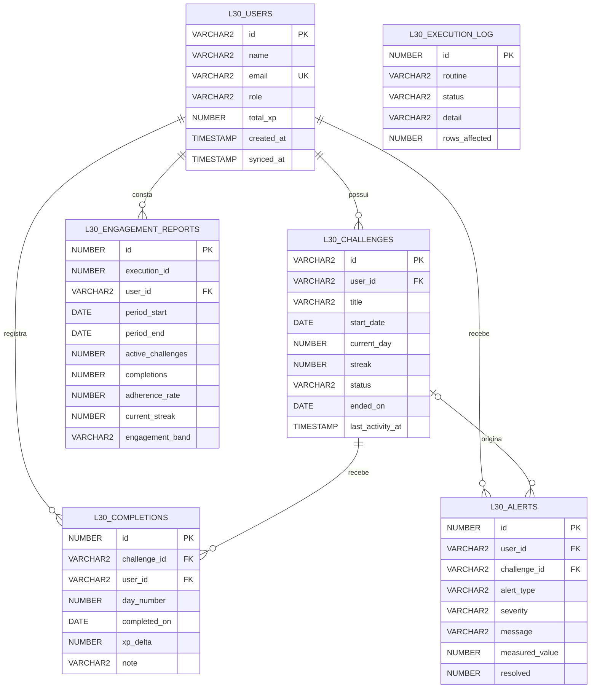

# Level30 · Smart HAS — Camada Oracle PL/SQL (Fase 6)

## Decisão arquitetural

O PostgreSQL continua sendo o banco transacional do Spring Boot. O Oracle entra como **camada de inteligência**: recebe uma réplica de usuários e desafios junto com cada evento de conclusão, e concentra indicadores, alertas e relatórios em PL/SQL.

```
App Flutter ──► Spring Boot ──► PostgreSQL        (estado operacional)
Dashboard   ──►     │
                    └─ JDBC ──► Oracle PL/SQL     (indicadores, alertas, relatórios)
```

A réplica é alimentada por evento (`pr_registrar_conclusao`), sem ETL separado. A procedure é idempotente, então reenviar o mesmo evento não duplica dados. Consistência entre os dois bancos é eventual; o Outbox Pattern fica registrado como evolução.

## Ordem de execução

| # | Script | Conteúdo |
|---|---|---|
| 0 | `00_drop.sql` | Limpeza (só objetos do projeto) |
| 1 | `01_ddl.sql` | Tabelas, constraints, índices e comentários |
| 2 | `02_carga_simulada.sql` | 13 usuários, desafios e ~75 dias de histórico |
| 3 | `03_plsql.sql` | Functions e procedures |
| 4 | `04_uso_pratico.sql` | Consultas e execuções para os prints |
| 5 | `05_job_opcional.sql` | Agendamento diário (requer `CREATE JOB`) |

No SQL Developer, rode cada arquivo como script (F5). Compatível com Oracle 19c ou superior.

## Como rodar

### Local (Docker, para dev/teste da integração Java)

Na raiz do projeto, com Docker instalado:

```bash
# 1. Suba o Oracle (demora ~1-2 min na primeira vez)
ORACLE_SYS_PASSWORD=senhaSys123 ORACLE_USER=level30 ORACLE_PASSWORD=senhaApp123 \
  docker compose -f docker-compose.oracle.yml up -d

# 2. Acompanhe até o healthcheck ficar "healthy"
docker compose -f docker-compose.oracle.yml ps

# 3. Rode os scripts, nesta ordem, como o usuário da aplicação (não como SYSTEM)
for f in 00_drop 01_ddl 02_carga_simulada 03_plsql 04_uso_pratico; do
  docker exec -i level30-oracle sqlplus -S level30/senhaApp123@//localhost/FREEPDB1 @/scripts/$f.sql
done

# 05_job_opcional.sql exige o privilégio CREATE JOB — rode à parte e ignore
# ORA-27486 se o usuário não tiver o privilégio (comum em ambiente acadêmico):
docker exec -i level30-oracle sqlplus -S level30/senhaApp123@//localhost/FREEPDB1 @/scripts/05_job_opcional.sql
```

Troque `senhaApp123`/`senhaSys123` pelos valores reais do seu `.env` (ver `backend/.env.example`).
O comando genérico, usando as variáveis de ambiente diretamente:

```bash
docker exec -i level30-oracle sqlplus -S "$ORACLE_USER/$ORACLE_PASSWORD@//localhost/FREEPDB1" @/scripts/01_ddl.sql
```

### Oracle da FIAP (SQL Developer)

1. Conecte com as credenciais do RM fornecidas pela FIAP.
2. Abra cada arquivo de `db/oracle/` na ordem da tabela acima.
3. Rode como **script** (F5, não "executar statement" com F9) — os blocos `DECLARE`/`BEGIN...END` e
   o `/` de fim de bloco dependem disso.
4. `05_job_opcional.sql` provavelmente falha com `ORA-27486` (usuário RM não tem `CREATE JOB`) —
   é esperado e documentado; a rotina `pr_verificar_inatividade` continua acionável pelo backend
   (`@Scheduled`, ver `LEVEL30_ORACLE_INATIVIDADE_JOB`).

## DER



## Mapa de requisitos da atividade

| Requisito do enunciado | Onde está atendido |
|---|---|
| Modelo lógico/físico Oracle | `01_ddl.sql` + DER acima |
| Implantar tabelas | `01_ddl.sql` |
| Importar dados simulados | `02_carga_simulada.sql` (perfis de comportamento) |
| Function de indicador | `fn_taxa_adesao` |
| Function de dados formatados | `fn_resumo_usuario` |
| IN, RETURN, exceções, comentários | Ambas as functions (códigos -20001 a -20003, -20099) |
| Functions integradas a consultas | `04_uso_pratico.sql`, consultas 1 a 5 |
| Procedure de alertas | `pr_verificar_inatividade` |
| Procedure de relatório resumido | `pr_gerar_relatorio_engajamento` |
| Procedure acionada pelo backend Java | `pr_registrar_conclusao` (REST → Spring → JDBC → Oracle) |
| EXCEPTION, IF, LOOP, CURSOR | Cursor FOR com parâmetro, cursor explícito OPEN/FETCH/CLOSE, WHILE LOOP na carga, IF/ELSIF nas faixas, SAVEPOINT e transação autônoma |

## Credenciais

Usuário e senha do Oracle nunca vão para o repositório. O backend lê de variáveis de ambiente (`ORACLE_URL`, `ORACLE_USER`, `ORACLE_PASSWORD`).
